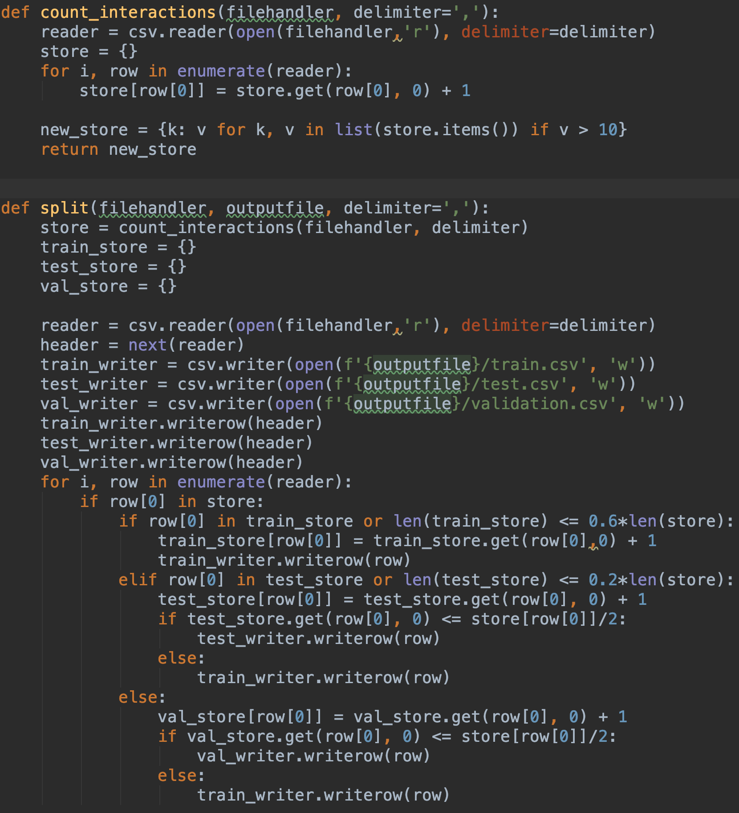

# Recommender System
##### Physical objects occupy space

- Brick-and-mortar shops must satisfy physical constraints
- Curators must prioritize for some notion of utility
- Serving the most customers, maximizing sales/profit, etc.

##### This is not true for digital items!

- The web, e-books, news article, movies, music, ... take up no physical space
- Without curation, this quickly becomes overwhelming

## The data set

In this project, we'll use the [Goodreads dataset](https://sites.google.com/eng.ucsd.edu/ucsdbookgraph/home) collected by

> Mengting Wan, Julian McAuley, "Item Recommendation on Monotonic Behavior Chains", RecSys 2018.

## Data splitting and Train using ALS

Relevant code script: csv_split.py/write_data.py/train.py

For data splitting and subsampling, the job is to split a whole data set into three parts including training set, testing set and validation set. The requirement is that both of testing set and validation set should contain 20% of total users, at the same time, all the users in these two sets should also exist in training set since the algorithm cannot predict users not appeared in training set. Therefore, we obtain the final format of data: training set has 60% ~ 80% of original data with 100% user id, while the other two data sets have 10% ~ 20% of original data with 20% user id each. In code, it just needs two functions to achieve the data splitting and subsampling.

